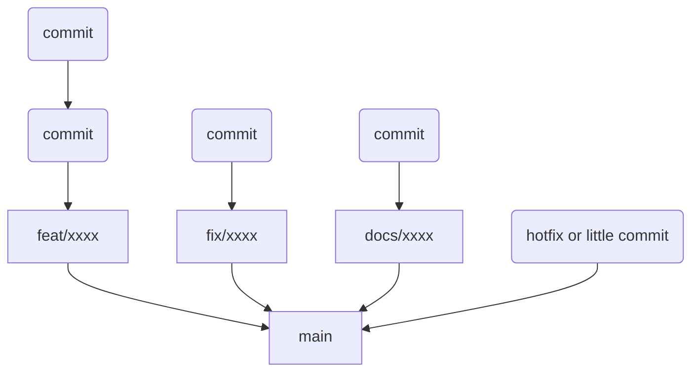

# CONTRIBUTING GUIDELINE

CONTRIBUTING GUIDELINE<br>

> [!NOTE]
> <sub>Used AI for some translations.</sub><br>
> 一部の翻訳にはAIを使用しています。

## flowchart


## Issue/Discussions

<sub>We accept feature proposals, bug reports, and feature ideas in Issues.</sub><br>
Issueでは機能案や、バグなどの報告などを受け付けています。<br>

<sub>If you can implement/resolve the feature/bug yourself, please indicate it.</sub><br>
機能案/バグを、ご自身で実装/解決して頂ける場合には、明記していただけると幸いです。<br>

<sub>We mainly accept questions in Discussions.</sub><br>
Discussionsでは、主に質問などを受け付けます。<br>

<sub>(It's OK to submit feature ideas on Discussions!)</sub><br>
(Discussions上で、機能のアイデアを提出してもOKです!)<br>

## PR

<sub>Of course, PRs are welcome.</sub><br>
もちろんPRも歓迎しています。<br>

<sub>For basic Pull Requests (especially minor ones), you can send a Pull Request without creating an Issue.</sub><br>
基本的なPull Request（特に細かいもの）は、Issueを立てずにPull Requestを送ってもらって問題ありません。<br>

<sub>However, please **always** create an Issue or Discussion for the following:</sub><br>
ただし、下記についてはIssue、もしくはDiscussionを**必ず**立ててください。<br>

- 大規模/中規模程度の機能追加 (例: 新たなConfig追加が必要な機能 / 新しいメニューが追加される など)
- UIの大幅な刷新

<br>

- Medium to large-scale feature additions (e.g., features requiring new Config / new menu additions, etc.)
- Major UI refreshes

<sub>Branch names will be mentioned later.</sub><br>
ブランチ名については後ほど後述します。<br>

## Commit Message

<sub>Commit messages in this repository are described as follows. (from 2026/01/10)</sub><br>
本リポジトリでのコミットメッセージは、下記のように記述します。(2026/01/10~)<br>

```
<type> (<scope>): <subject> (#<Issue Number>)

<more info>
```

<sub>Details are as follows.</sub><br>
それぞれについては以下のとおりです。<br>

### `<type>`

- `feat`     新機能の追加
- `fix`      バグの修正  
- `docs`     ドキュメントの変更 (例: README.md など)
- `style`    インデント/空白など、コードスタイルの変更(統一)
- `refactor` コードの内部構造を変更したが、外部から見た動作は変わらない変更
- `chore`    補助ツール、開発環境などの管理に関する変更(例: .gitignoreや依存関係など)
- `ci`       GitHub Actionsなどのワークフローの変更
- `typo`     タイプミスの修正
- `revert`   `git revert` などを使用した際のコミット

<br>

- `feat`     Addition of new features
- `fix`      Bug fixes  
- `docs`     Documentation changes (e.g., README.md, etc.)
- `style`    Changes to code style such as indentation/spaces (unification)
- `refactor` Changes to internal code structure that do not change external behavior
- `chore`    Changes related to auxiliary tools, development environment management (e.g., .gitignore or dependencies)
- `ci`       Changes to workflows such as GitHub Actions
- `typo`     Typo corrections
- `revert`   Commits using `git revert`, etc.

### `<scope>` **(Optional)**

<sub>An element indicating the feature where changes were made. Describe specific files, features, etc.</sub><br>
変更を行った機能を示す要素です。特定のファイル、機能等を記述します。<br>

<sub>It can be omitted.</sub><br>
省略しても構いません。<br>

<sub>> Example: `README.md`, `Connect`, etc.</sub><br>
> 例: `README.md`, `Connect` など<br>

### `<Issue Number>` **(Recommended)**

<sub>It is recommended to describe if there is a related Issue.</sub><br>
関連Issueが存在する場合には記述することを推奨します。<br>

<sub>It can be omitted if none.</sub><br>
ない場合は省略して構いません。<br>

### `<subject>`

<sub>The body.</sub><br>
本文です。<br>

### `<more info>` **(Optional)**

<sub>Please include more detailed explanations.</sub><br>
より詳細な説明を記載してください。<br>

<sub>It can be omitted.</sub><br>
省略しても構いません。<br>

### Example
```
feat: Add q keymap as exit (#36)
fix: wrong variable in conditional check 
```

<sub>If you have any questions, refer to past commits,</sub><br>
不明な点は過去のコミットを参考に、<br>

<sub>or inquire in Discussions.</sub><br>
もしくはDiscussionsにてお問い合わせください。<br>

## Branch Name

<sub>Please set branch names in this repository as follows.</sub><br>
本リポジトリでのブランチ名については次のように設定してください。<br>

`<type>/<subject>-#<Issue Number>`<br>

<sub>Details are as follows.</sub><br>
それぞれについては以下のとおりです。<br>

### `<type>`

<sub>Same as Commit Message.</sub><br>
Commit Messageと同様です。<br>

### `<subject>`

<sub>Mostly the same as Commit Message.</sub><br>
Commit Messageと概ね同様です。<br>

<sub>Use `-` for spaces.</sub><br>
空白には`-`を使用してください。<br>

### `<Issue Number>`

<sub>Same as Commit Message.</sub><br>
Commit Messageと同様です。<br>

### Example
```
feat/Add-q-keymap-as-exit-#36
fix/cant-skip-config-when-edit-target
```

<sub>If you have any questions, refer to past commits,</sub><br>
不明な点は過去のコミットを参考に、<br>

<sub>or inquire in Discussions.</sub><br>
もしくはDiscussionsにてお問い合わせください。<br>

## Build

<sub>This program is developed in the following environment. (as of 2026/03/11)</sub><br>
本プログラムは下記の環境で開発しています。(2026/03/11時点)<br>

- Windows 11 (Build 26200)
- Microsoft Visual Studio Community 2026
- Neovim 0.11.6
- WezTerm Nightly

<sub>Currently, verification is performed based on this setting. (as of 2026/03/21)</sub><br>
現在はこちらの設定に基づいた環境で検証を行っています。(2026/03/21時点)<br>

<a href="https://github.com/T-b-t-nchos/dotfiles">https://github.com/T-b-t-nchos/dotfiles</a><br>

<sub>Clone the repository to `~\source\repos\Aquavium.nvim` when developing.</sub><br>
開発の際は`~\source\repos\Aquavium.nvim`にクローンしてください。<br>
