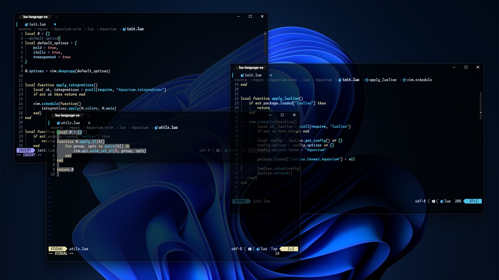
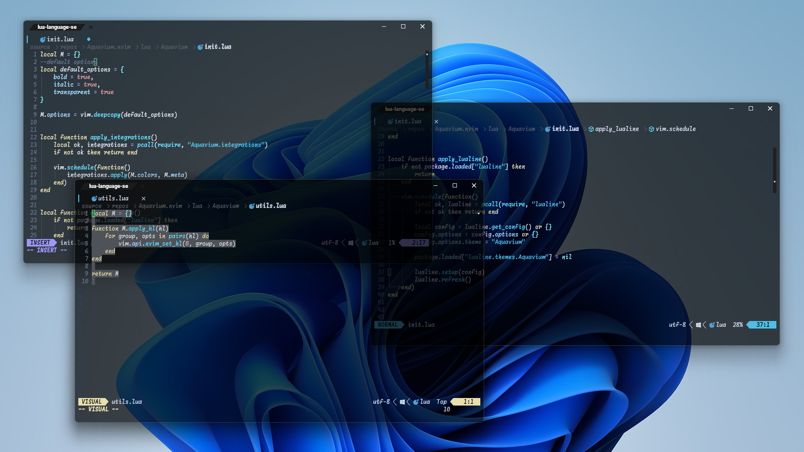
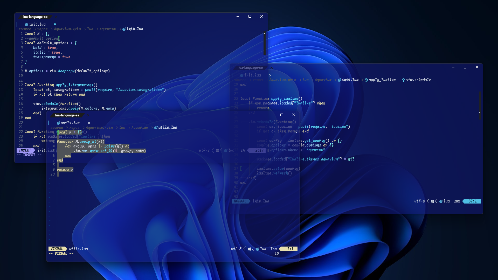
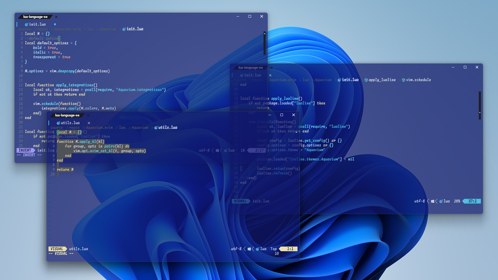

<center><h1>🪼 Aquavium.nvim 🦈</h1></center>
<center><sub>Aquarium color scheme on Neovim</sub></center>

## ✨ 概要 - Overview -
<sub>"Aquavium" is designed for use with a transparent terminal background</sub>  
"Aquavium"はターミナルの背景を透過させることを前提とした、  
<sub>and features an aquarium-themed color scheme</sub>    
水族館をモチーフにしたカラーテーマです。  

## 📷️ 画像 - Images -





## 💼 依存関係 - dependents -
- Neovim 0.11 >=
- treesitter.nvim (Optional)

## 🧩 対応しているプラグイン - supported plugins -
- lualine
- bufferline
- nvim-treesitter-context

## 🔧 インストール - Install -
### On terminal
<sub>Please set opacity</sub>  
透明度を設定してください。  
  
例(example):
```lua
---- WezTerm Nightly
-- Set background color
config.window_background_gradient = {colors = {'#000000'}} -- or other color

-- Set opacity
config.window_background_opacity = 0.7

--config.window_background_opacity = opacity_state
--config.window_decorations = 'INTEGRATED_BUTTONS'
```
### On Neovim
#### Lazy.nvim
```
WIP ...
```

## 💡 インスピレーション元 - source of inspire -

<sub>This color theme is inspired from [The Aquarium does not dance](https://daidai7742.wixsite.com/aqua-dance).</sub>  
本カラーテーマは[アクアリウムは踊らない](https://daidai7742.wixsite.com/aqua-dance)より、インスピレーションを受けました。  
<sub>(2026/02/15) Happy 2nd Anniversary!</sub>  
(2026/02/15) 二周年、おめでとうございます!
  
> [!WARNING]
> This work is a fan creation and has no affiliation with the official creators.  
> 本作品は、公式様とは一切の関わりを持たない、ファンによる作品です。  

