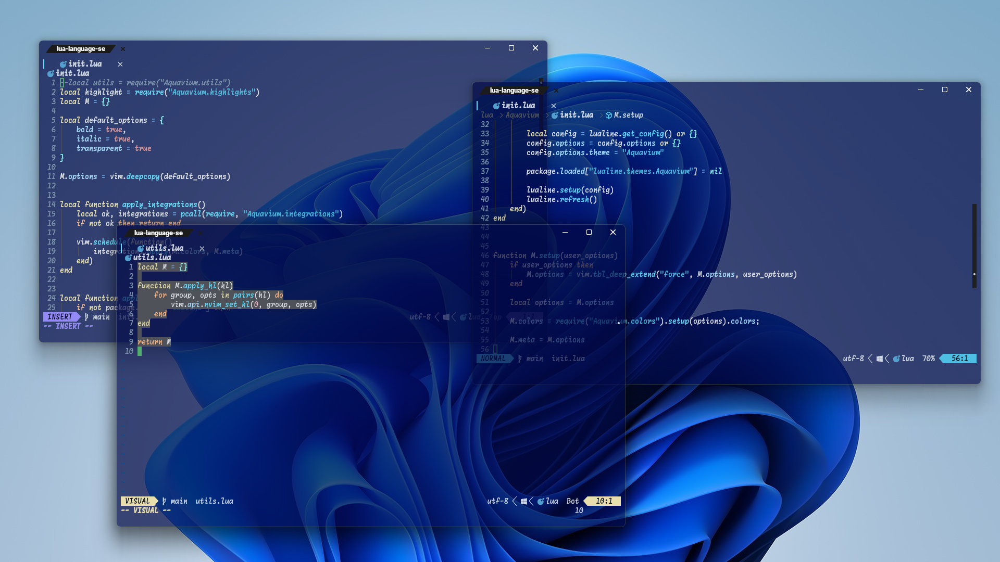

<div align="center">
    <h1>🪼 Aquavium.nvim 🦈</h1>
    <sub>Aquarium color scheme on Neovim</sub>
</div>

<br>

<div align="center">
    
</div>

## ✨ 概要 - Overview -
<sub>"Aquavium" is designed for use with a transparent terminal background</sub>  
"Aquavium"はターミナルの背景を透過させることを前提とした、  
<sub>and features an aquarium-themed color scheme</sub>    
水族館をモチーフにしたカラーテーマです。  

## 📷️ プレビュー - Preview -

|TermColor|dark-wallpaper|light-wallpaper|
|---|---|---|
|black|||
|blue|||

## 💼 依存関係 - Dependents -
- [Neovim](https://github.com/neovim/neovim) 0.11+
- [nvim-treesitter](https://github.com/nvim-treesitter/nvim-treesitter) (Optional)

## 🧩 対応しているプラグイン - Supported plugins -
- [bufferline.nvim](https://github.com/akinsho/bufferline.nvim)
- [dashboard-nvim](https://github.com/nvimdev/dashboard-nvim/)
- [lazy.nvim](https://github.com/folke/lazy.nvim)
- [lualine.nvim](https://github.com/nvim-lualine/lualine.nvim)
- [Markview.nvim](https://github.com/OXY2DEV/markview.nvim)
- [nvim-notify](https://github.com/rcarriga/nvim-notify)
- [nvim-treesitter-context](https://github.com/nvim-treesitter/nvim-treesitter-context)

## 🔧 インストール - Install -
### In terminal
<sub>Please set opacity</sub>  
透明度を設定してください。  
  
> [!TIP]
> <sub>Recommend background: #000, transparent: 70%</sub>  
> 推奨 背景: #000, 不透明度: 70%  

例(example):
```lua
---- WezTerm Nightly
-- Set background color
config.window_background_gradient = {colors = {'#000000'}} -- or other color

-- Set opacity
config.window_background_opacity = 0.7

--config.window_background_opacity = opacity_state
--config.window_decorations = 'INTEGRATED_BUTTONS'
```
### In Neovim
#### Lazy.nvim
```lua
{
    "T-b-t-nchos/Aquavium.nvim",
    lazy = false,
    priority = 1000,
    config = function()
        local aquavium = require("Aquavium")

        aquavium.setup({
            -- options

            ---- For example,
            -- bold = false,
            -- italic = false,
            -- transparent = false,
        })

        vim.cmd("colorscheme Aquavium")
    end,
},
```

## 🛠️ オプション - Options -
```lua
{
    bold = true,        -- enable/disable to use bold-style
    italic = true,      -- enable/disable to use italic-style
    transparent = true, -- enable/disable transparent background
}
```

## 💡 インスピレーション元 - Source of inspire -

<sub>This color theme is inspired by [The Aquarium does not dance](https://daidai7742.wixsite.com/aqua-dance).</sub>  
本カラーテーマは[アクアリウムは踊らない](https://daidai7742.wixsite.com/aqua-dance)より、インスピレーションを受けました。  
<sub>For more details, please see [here](./docs/TADND.md).</sub>  
アクアリウムは踊らないについて、詳しくは[こちら](./docs/TADND.md)を御覧ください。  
<sub>(2026/02/15) Happy 2nd Anniversary!</sub>  
(2026/02/15) 二周年、おめでとうございます!
  
> [!WARNING]
> This work is a fan creation and has no affiliation with the official creators.  
> 本作品は、公式様とは一切の関わりを持たない、ファンによる作品です。  

## 🙏 お願い - Request to you -
> <sub>This is my first time developing a color scheme. So, there may be some issues.</sub>  
> このカラースキームは、私の初めてのカラースキーム開発です。そのため、不具合などがある可能性があります。  
> <sub>I'd love to take a look at your GitHub issue or PR if you find any issues.</sub>  
> 不具合などを見つけた場合は、Issue/PRの作成を、ぜひお願い致します。

> <sub>Also, I’d love to see any requests on GitHub issues.</sub>  
> また、GitHub issue 上でのリクエスト等もお待ちしています。

## 👥 貢献者 - Contributors -
<sub>See here:</sub>  
こちらをご覧ください:  **[🤝Contributors.md](./Contributors.md)**
